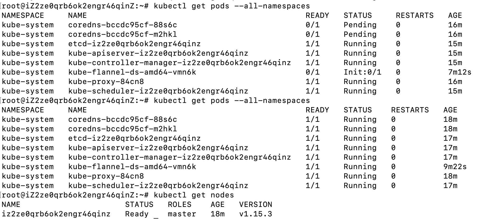

通过命令查看node是否启动

# Kubernetes使用指南--入门基础

> Auth: 王海飞
>
> Data：2020-08-06
>
> Email：779598160@qq.com
>
> github：https://github.com/coco369/knowledge

------

### 前言

​	kubernetes，简称K8s，是一个开源的，用于管理云平台中多个主机上的容器化的应用，Kubernetes的目标是让部署容器化的应用简单并且高效（powerful）,Kubernetes提供了应用部署，规划，更新，维护的一种机制。

​        kubernetes 是一个分布式的集群管理系统，在每个节点（node）上都要运行一个 worker 对容器进行生命周期的管理，这个 worker 程序就是 kubelet。简单地说，kubelet 的主要功能就是定时从某个地方获取节点上 pod/container 的期望状态（运行什么容器、运行的副本数量、网络或者存储如何配置等等），并调用对应的容器平台接口达到这个状态。

​        kubectl是Kubernetes集群的命令行工具，通过kubectl能够对集群本身进行管理，并能够在集群上进行容器化应用的安装部署。

#### k8s架构图：


#### 1. 部署方式

k8s的部署方式：

    kubesadmin（初学使用）
    
    二进制（开发环境用得多）
    
    minikube（测试环境，快速的启动）
    
    yum

#### 2. 安装

需要安装以下内容：

    docker / kubeadm / kubelet / kubectl

##### 2.1) 安装kubeadm

默认情况下安装kubernetes需要google外网。可以通过设置以下的镜像站来绕过google：

```haskell
google地址被墙的情况下可以使用阿里云或者中科大的镜像站：

sudo apt-get update && sudo apt-get install -y apt-transport-https curl

sudo curl -s https://mirrors.aliyun.com/kubernetes/apt/doc/apt-key.gpg | sudo apt-key add -

# 向源文件kubernetes.list中加入源
sudo tee /etc/apt/sources.list.d/kubernetes.list <<-'EOF'
deb https://mirrors.aliyun.com/kubernetes/apt kubernetes-xenial main
EOF

# 更新源
sudo apt-get update

# 安装kubeadm (只需安装kubeadm就可以将kubectl喝kubelet一起安装好了)
apt install kubeadm=1.15.3-00 kubelet=1.15.3-00 kubectl=1.15.3-00
```

**注意：**kubeadm和docker是有版本兼容问题的。目前kubeadm用的是1.15.3的版本，docker使用19.03.6的版本

**2.2) kubeadm命令：**

kubeadm这个工具可以通过简单的`kubeadm init`和`kubeadm join`命令来创建一个kubernetes集群，kubeadm提供的其他命令都比较通俗易懂：

- `kubeadm init` 启动一个master节点；
- `kubeadm join` 启动一个node节点，加入master；
- `kubeadm upgrade` 更新集群版本；
- `kubeadm token` 管理`kubeadm join`的token；
- `kubeadm reset` 把`kubeadm init`或`kubeadm join`做的更改恢复原状；
- `kubeadm version`打印版本信息；
- `kubeadm alpha`预览一些alpha特性的命令。
- kubeadm reset   重启kubeadm

**2.3) 修改hostname**

​	修改主机和从机的hostname

​		hostname k8s-master 

​		hostname k8s-node1

#### 3. 初始化Master节点

```

sudo kubeadm init \
--apiserver-advertise-address=39.105.231.7 \
--image-repository registry.aliyuncs.com/google_containers \
--service-cidr=10.233.0.0/16 \
--pod-network-cidr=10.16.0.0/16 \
--kubernetes-version v1.15.3

```

**参数说明：**

​	image-repository： 指定镜像仓库，否则默认情况下要翻墙才能获取镜像

​	service-cidr：proxy代理，给每一个pod提供统一的入口，指定一个范围的IP

​	pod-network-cidr：指定pod网络中每一个容器需要的IP范围。设置网络插件，一般选择Flannel

​	kubernetes-version：指定k8s的版本

​	apiserver-advertise-address：apiserver暴露出去的地址。如果不设置或者设置为0.0.0.0，那么将使用默认的接口的IP地址

​	apiserver-bind-port: API SERVER将绑定的端口，默认为6443

**kubeadm init 执行成功：**

sudo kubeadm init  --pod-network-cidr=10.16.0.0/16 --image-repository registry.aliyuncs.com/google_containers


#### 4. 安装pod网络插件CNI

```
1. 直接安装
kubectl apply -f https://raw.githubusercontent.com/coreos/flannel/master/Documentation/kube-flannel.yml

2. 先下拉yml文件，再修改镜像源，最后安装
curl  -o  kube-flannel.yml  https://raw.githubusercontent.com/coreos/flannel/master/Documentation/kube-flannel.yml

# 把yml文件中的所有的quay.io改为quay-mirror.qiniu.com文件
sed  -i  's/quay.io/quay-mirror.qiniu.com/g'   kube-flannel.yml

# 在master节点执行以下命令
kubectl apply -f kube-flannel.yml
```

通过命令查看node是否启动：


**注意：**

安装flannel网络插件的时候，可能出现提示raw.githubusercontent.com网络无法访问的情况和‘possibly because of "crypto/rsa: verification error" while trying to verify candidate authority certificate "kubernetes"’的情况，解决办法如下：

1. 修改vim /etc/hosts，并加入 151.101.76.133  raw.githubusercontent.com
2. 设置 export KUBECONFIG=/etc/kubernetes/kubelet.conf，然后再执行kubectl apply -f 命令

3. 如果发现node节点的状态为NotReady，那么可以通过kubectl get pods -n cube-system命令查看pods的状态：（发现还有pending的状态，其实是在下载，只需要等待一直安装好即可，安装好以后，状态就是Ready）

   3.1)  如果还是pending状态，可以通过命令kubectl logs -f coredns-bccdc95cf-jt2pk -n kube-system进行查看

   3.2) 执行kubectl get pods -n cube-system -o wide命令，可以查看Pending状态的镜像下载不成功的原因，下图表示解析不到IP，master上的flannel镜像拉取失败。




#### 5. 创建node

kubeadm join 172.17.122.36:6443 --token 6exeih.f78evby9qnnh2uwk \

​    --discovery-token-ca-cert-hash sha256:c48329da64826fd041b15dd0e629c7c67c0e33870ffa0fa26ae278d638c40a75


kubeadm join 172.17.122.36:6443 --token uzfaqz.1gop8dpexugg1kl1 \

​    --discovery-token-ca-cert-hash sha256:e5547e5b8e549db6cb423727801739a98f5df9bfa2d21ea61ce4c9716e37b8cf