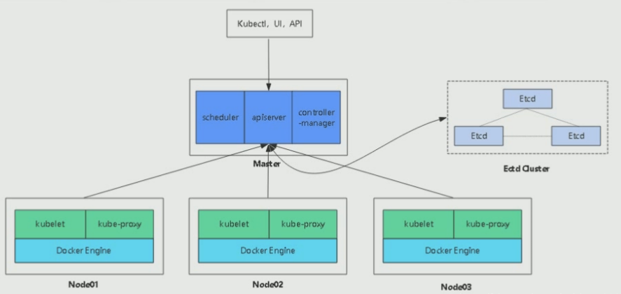
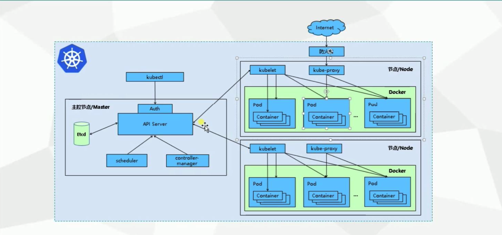

# Kubernetes使用指南--入门基础

> Auth: 王海飞
>
> Data：2020-08-06
>
> Email：779598160@qq.com
>
> github：https://github.com/coco369/knowledge

------

### 前言

​	kubernetes，简称K8s，是一个开源的，用于管理云平台中多个主机上的容器化的应用，Kubernetes的目标是让部署容器化的应用简单并且高效（powerful）,Kubernetes提供了应用部署，规划，更新，维护的一种机制。

​        kubernetes 是一个分布式的集群管理系统，在每个节点（node）上都要运行一个 worker 对容器进行生命周期的管理，这个 worker 程序就是 kubelet。简单地说，kubelet 的主要功能就是定时从某个地方获取节点上 pod/container 的期望状态（运行什么容器、运行的副本数量、网络或者存储如何配置等等），并调用对应的容器平台接口达到这个状态。

​        kubectl是Kubernetes集群的命令行工具，通过kubectl能够对集群本身进行管理，并能够在集群上进行容器化应用的安装部署。

#### k8s架构图：






#### 1. 部署方式

k8s的部署方式：

    kubesadmin（初学使用）
    
    二进制（开发环境用得多）
    
    minikube（测试环境，快速的启动）
    
    yum

#### 2. 安装

需要安装以下内容：

    docker / kubeadm / kubelet / kubectl

##### 安装kubeadm

默认情况下安装kubernetes需要google外网。可以通过设置以下的镜像站来绕过google：

```haskell
google地址被墙的情况下可以使用阿里云或者中科大的镜像站：

sudo apt-get update && sudo apt-get install -y apt-transport-https curl

sudo curl -s https://mirrors.aliyun.com/kubernetes/apt/doc/apt-key.gpg | sudo apt-key add -

# 向源文件kubernetes.list中加入源
sudo tee /etc/apt/sources.list.d/kubernetes.list <<-'EOF'
deb https://mirrors.aliyun.com/kubernetes/apt kubernetes-xenial main
EOF

# 更新源
sudo apt-get update

# 安装kubeadm (只需安装kubeadm就可以将kubectl喝kubelet一起安装好了)
apt install kubeadm
```

#### 3. 初始化Master节点

```

sudo kubeadm init \
--apiserver-advertise-address=39.105.231.7 \
--image-repository registry.aliyuncs.com/google_containers \
--service-cidr=10.233.0.0/16 \
--pod-network-cidr=10.16.0.0/16 \
--kubernetes-version v1.17.0

```

参数说明：

​	image-repository： 指定镜像仓库，否则默认情况下要翻墙才能获取镜像

​	service-cidr：proxy代理，给每一个pod提供统一的入口，指定一个范围的IP

​	pod-network-cidr：指定pod网络中每一个容器需要的IP范围

​	kubernetes-version：指定k8s的版本

​	apiserver-advertise-address：apiserver暴露出去的地址

#### 4. 安装pod网络插件CNI

```
kubectl apply -f https://raw.githubusercontent.com/coreos/flannel/v0.9.1/Documentation/kube-flannel.yml
```

#### 5. 创建node

